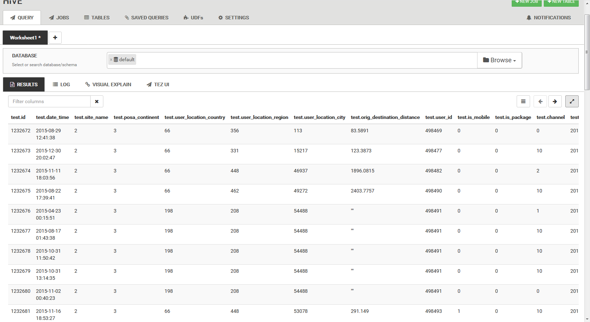

# file-converter

## Steps to run:

- run sbt:
```
sbt assembly
```
- download destinations.csv and test.csv from https://www.kaggle.com/c/expedia-hotel-recommendations/data
- put these files into hdfs. For example: 
```
hdfs dfs -put /path/to/test.csv /tmp/test.csv
```
- ```./run.sh``` with **parquet** command and test.schema
- to be able to view parquet file content, go to the Hive UI and execute the following script:
```haskell
CREATE EXTERNAL TABLE test (
	id STRING,
	date_time STRING,
	site_name STRING,
	posa_continent STRING,
	user_location_country STRING,
	user_location_region STRING,
	user_location_city STRING,
	orig_destination_distance STRING,
	user_id STRING,
	is_mobile STRING,
	is_package STRING,
	channel STRING,
	srch_ci STRING,
	srch_co STRING,
	srch_adults_cnt STRING,
	srch_children_cnt STRING,
	srch_rm_cnt STRING,
	srch_destination_id STRING,
	srch_destination_type_id STRING,
	hotel_continent STRING,
	hotel_country STRING,
	hotel_market STRING)
STORED AS PARQUET
LOCATION '/tmp/test/'; 
```
- now you can query the parquet file for some data, for example: ```select * from test```

## Application description

The application is a command line tool that provides a mr job to convert a csv file to avro/parquet files.

Args:
```[avro|parquet] -i(--in) -o(--out) -s(--schema) -h(--header)```

> *-i or --in* - input file location in the hdfs (should exist)<br>
*-o or --out* - output file directory in the hdfs (should not exist)<br>
*-s or --schema* - schema file in the local file system (should exist)<br>
*-h or --header* - a flag, if present, the header of the input file will not be ignored<br>

Depending on command specified, the job consist of either AvroMapper or ParquetMapper task and with no reduce tasks.

## Test run example

Console output: 
```shell
[maria_dev@sandbox-hdp fileConverter]$ ./run.sh                                                                                                                                         
HADOOP_CLASSPATH=./file-converter.jar                                                                                                                                                   
18/11/02 15:28:50 INFO client.RMProxy: Connecting to ResourceManager at sandbox-hdp.hortonworks.com/172.18.0.2:8032                                                                     
18/11/02 15:28:50 INFO client.AHSProxy: Connecting to Application History server at sandbox-hdp.hortonworks.com/172.18.0.2:10200                                                        
18/11/02 15:28:50 WARN mapreduce.JobResourceUploader: Hadoop command-line option parsing not performed. Implement the Tool interface and execute your application with ToolRunner to rem
edy this.                                                                                                                                                                               
18/11/02 15:28:51 INFO input.FileInputFormat: Total input paths to process : 1                                                                                                          
18/11/02 15:28:51 INFO mapreduce.JobSubmitter: number of splits:2                                                                                                                       
18/11/02 15:28:51 INFO mapreduce.JobSubmitter: Submitting tokens for job: job_1541077239501_0018                                                                                        
18/11/02 15:28:52 INFO impl.YarnClientImpl: Submitted application application_1541077239501_0018                                                                                        
18/11/02 15:28:52 INFO mapreduce.Job: The url to track the job: http://sandbox-hdp.hortonworks.com:8088/proxy/application_1541077239501_0018/                                           
18/11/02 15:28:52 INFO mapreduce.Job: Running job: job_1541077239501_0018                                                                                                               
18/11/02 15:28:58 INFO mapreduce.Job: Job job_1541077239501_0018 running in uber mode : false                                                                                           
18/11/02 15:28:58 INFO mapreduce.Job:  map 0% reduce 0%                                                                                                                                 
18/11/02 15:29:09 INFO mapreduce.Job:  map 5% reduce 0%                                                                                                                                 
18/11/02 15:29:10 INFO mapreduce.Job:  map 11% reduce 0%                                                                                                                                
18/11/02 15:29:12 INFO mapreduce.Job:  map 18% reduce 0%                                                                                                                                
18/11/02 15:29:13 INFO mapreduce.Job:  map 26% reduce 0%                                                                                                                                
18/11/02 15:29:15 INFO mapreduce.Job:  map 33% reduce 0%                                                                                                                                
18/11/02 15:29:16 INFO mapreduce.Job:  map 41% reduce 0%                                                                                                                                
18/11/02 15:29:18 INFO mapreduce.Job:  map 49% reduce 0%                                                                                                                                
18/11/02 15:29:19 INFO mapreduce.Job:  map 58% reduce 0%                                                                                                                                
18/11/02 15:29:21 INFO mapreduce.Job:  map 66% reduce 0%                                                                                                                                
18/11/02 15:29:22 INFO mapreduce.Job:  map 74% reduce 0%                                                                                                                                
18/11/02 15:29:24 INFO mapreduce.Job:  map 82% reduce 0%                                                                                                                                
18/11/02 15:29:25 INFO mapreduce.Job:  map 91% reduce 0%                                                                                                                                
18/11/02 15:29:27 INFO mapreduce.Job:  map 100% reduce 0%                                                                                                                               
18/11/02 15:29:30 INFO mapreduce.Job: Job job_1541077239501_0018 completed successfully                                                                                                 
18/11/02 15:29:30 INFO mapreduce.Job: Counters: 30                                                                                                                                      
        File System Counters                                                                                                                                                            
                FILE: Number of bytes read=0                                                                                                                                            
                FILE: Number of bytes written=307812                                                                                                                                    
                FILE: Number of read operations=0                                                                                                                                       
                FILE: Number of large read operations=0                                                                                                                                 
                FILE: Number of write operations=0                                                                                                                                      
                HDFS: Number of bytes read=276685794                                                                                                                                    
                HDFS: Number of bytes written=59516829                                                                                                                                  
                HDFS: Number of read operations=10                                                                                                                                      
                HDFS: Number of large read operations=0                                                                                                                                 
                HDFS: Number of write operations=4                                                                                                                                      
        Job Counters                                                                                                                                                                    
                Launched map tasks=2                                                                                                                                                    
                Data-local map tasks=2                                                                                                                                                  
                Total time spent by all maps in occupied slots (ms)=54844                                                                                                               
                Total time spent by all reduces in occupied slots (ms)=0                                                                                                                
                Total time spent by all map tasks (ms)=54844                                                                                                                            
                Total vcore-milliseconds taken by all map tasks=54844                                                                                                                   
                Total megabyte-milliseconds taken by all map tasks=13711000                                                                                                             
        Map-Reduce Framework                                                                                                                                                            
                Map input records=2528244                                                                                                                                               
                Map output records=2528243                                                                                                                                              
                Input split bytes=246                                                                                                                                                   
                Spilled Records=0                                                                                                                                                       
                Failed Shuffles=0                                                                                                                                                       
                Merged Map outputs=0                                                                                                                                                    
                GC time elapsed (ms)=7695                                                                                                                                               
                CPU time spent (ms)=54420                                                                                                                                               
                Physical memory (bytes) snapshot=665292800                                                                                                                              
                Virtual memory (bytes) snapshot=3904479232                                                                                                                              
                Total committed heap usage (bytes)=312475648                                                                                                                            
        File Input Format Counters                                                                                                                                                      
                Bytes Read=276685548                                                                                                                                                    
        File Output Format Counters                                                                                                                                                     
                Bytes Written=59516829                                                                                                                                                  
Success: true                                                                                                                                                                           
```
After hive table creation, we can view the parquet file content:


